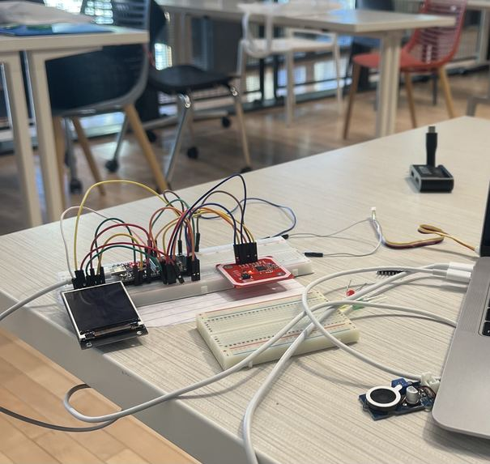
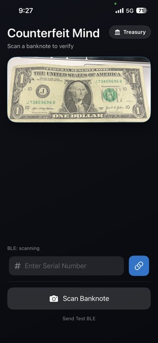
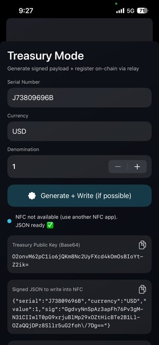

# CounterfeitMind

**An open-source multi-layer banknote authentication system combining NFC, Ed25519 cryptography, AI vision, and Ethereum blockchain to combat currency counterfeiting.**

> Built for demonstration and research purposes. All components are open source and designed to be reproducible.

---

## The Problem

Physical cash has barely evolved despite our digital world. Banknotes still rely on analog security features — watermarks, holograms, microprinting — but most businesses use a simple iodine-based counterfeit pen for convenience. The problem: that pen reacts to wood-based paper, not counterfeit ink. Counterfeiters sidestep it entirely by using the right paper material, or by "bleaching" foreign currencies and reprinting on them.

CounterfeitMind proposes a new authentication layer: an **NFC chip embedded in the banknote at manufacturing time**, signed by the Department of Treasury's private key and registered immutably on a public blockchain. Verification is instant, hardware-assisted, and cryptographically sound.

---

## How It Works

### Treasury (Issuing a Banknote)

1. The Treasury operator opens the **iOS app** in Treasury mode.
2. They enter the banknote's serial number, currency, and denomination.
3. The app signs the data using **Ed25519** and registers it on the **Ethereum (Sepolia) blockchain** via a relay server.
4. The app writes a signed JSON payload as an **NDEF record** to an NFC tag (or embedded NTAG 424 DNA chip) attached to the banknote.

### User (Verifying a Banknote)

1. The user opens the **iOS app** and points the camera at the banknote.
2. **Google Gemini AI** reads the note and extracts the serial number, currency, and denomination.
3. The app sends this data to the **ESP32 hardware device** over **Bluetooth LE**.
4. The user taps the banknote on the ESP32's **PN532 NFC reader**.
5. The ESP32:
   - Reads the NFC tag's signed payload.
   - Compares the NFC data with what the camera saw (field matching).
   - Verifies the **Ed25519 signature** using the treasury's public key.
   - Optionally queries the **blockchain** for the bill's registration record.
6. The **TFT display** shows `VERIFIED ✓` (green) or `ALERT ✗` (red) with a reason.

---

## System Architecture

```
┌─────────────────────────────────────────────────────────────────┐
│                        TREASURY PATH                           │
│                                                                 │
│  iOS App (Treasury Mode)                                        │
│    └─ Sign payload (Ed25519)                                    │
│    └─ POST /register ──► Blockchain Relay Server                │
│                              └─ registerBill() ──► Ethereum     │
│    └─ Write NDEF ──────────► NFC Tag on Banknote                │
└─────────────────────────────────────────────────────────────────┘

┌─────────────────────────────────────────────────────────────────┐
│                      VERIFICATION PATH                          │
│                                                                 │
│  Camera ──► Gemini AI ──► BanknoteFields (serial, currency, $)  │
│               └─ BLE send ──────────────────► ESP32             │
│               └─ GET /bill/{serial} [optional]                  │
│                   └─ BLE chain result ──────► ESP32             │
│                                                                 │
│  Banknote NFC Tag ──► PN532 Reader ──► ESP32                    │
│                          └─ Verify Ed25519 signature            │
│                          └─ Match fields vs camera data         │
│                          └─ Display result on TFT               │
└─────────────────────────────────────────────────────────────────┘
```

---

## Repository Structure

```
CounterfeitMind/
├── ESP32/
│   └── Main.cpp                  # Arduino firmware (NFC reader, BLE, TFT display)
├── iOSapp/
│   ├── ContentView.swift         # Main UI and app orchestration
│   ├── CameraService.swift       # Camera capture + Gemini AI integration
│   ├── CameraPreview.swift       # AVFoundation camera preview component
│   ├── GeminiClient.swift        # Google Gemini API client
│   ├── BLEManager.swift          # CoreBluetooth BLE communication
│   └── TreasuryNFCWriter.swift   # NFC tag writer + blockchain registration
├── blockchain-server.js          # Node.js relay server (ethers.js + Express)
├── abi.json                      # Ethereum smart contract ABI
└── README.md
```

---

## Hardware Setup

The hardware prototype uses an **ESP32 Dev Module** with:
- **Adafruit PN532** NFC reader (HSPI SPI, pins 15/19/2/21)
- **ST7789 TFT display** 240×320 (SPI, pins 5/22/4)
- Both peripherals share the SPI bus with separate chip select pins

**BLE Device Name:** `CounterEye`

> The hardware photo below shows the breadboard wiring used for the demo.



---

## Demo Screenshots

| App — Scanning a Bill | Treasury — Signature Generated |
|---|---|
|  |  |

---

## Getting Started

### Prerequisites

| Component | Requirements |
|---|---|
| iOS App | Xcode 15+, iOS 16+, physical iPhone (NFC + BLE) |
| ESP32 Firmware | Arduino IDE or PlatformIO, ESP32 board package |
| Blockchain Server | Node.js 18+, Ethereum wallet + RPC endpoint |

---

### 1. Blockchain Relay Server

```bash
# Install dependencies
npm install express cors ethers

# Set environment variables
export RPC_URL="https://sepolia.infura.io/v3/YOUR_PROJECT_ID"
export PRIVATE_KEY="0xYOUR_TREASURY_PRIVATE_KEY"
export CONTRACT_ADDRESS="0xYOUR_DEPLOYED_CONTRACT_ADDRESS"

# Start server
node blockchain-server.js
```

The server exposes:
- `GET  /health` — server status, treasury address, wallet balance
- `POST /register` — register a new bill `{ serial, currency, value }`
- `GET  /bill/:serial` — query registration status for a serial number

> The smart contract ABI is in `abi.json`. Deploy your own contract or use a compatible one that implements `registerBill`, `getBill`, and `isIssued`.

---

### 2. ESP32 Firmware

**Arduino Library Dependencies:**
- `Adafruit PN532`
- `Adafruit ST7789` + `Adafruit GFX`
- `ArduinoJson`
- `NimBLE-Arduino`
- `Ed25519` (or compatible Ed25519 library)
- `mbedTLS` (bundled with ESP32 Arduino core)

Open `ESP32/Main.cpp` in Arduino IDE, set your board to **ESP32 Dev Module**, and flash.

**Key configuration at the top of `Main.cpp`:**
```cpp
// Replace with the treasury's actual Ed25519 public key (Base64)
static const char* TREASURY_PUBKEY_B64 = "O2onvM62pC1io6jQKm8Nc2UyFXcd4kOmOsBIoYtZ2ik=";
```

---

### 3. iOS App

Open the `iOSapp/` directory in Xcode. Before building:

**a) Gemini API Key** — in `CameraService.swift`:
```swift
private let apiKey = "YOUR_GEMINI_API_KEY"
```

**b) Relay Server URL** — in `ContentView.swift` and `TreasuryNFCWriter.swift`:
```swift
private let relayBaseURL = "http://YOUR_SERVER_IP:8787"
```

**c) Ed25519 Key Pair** — in `TreasuryNFCWriter.swift`, replace the demo zero-seed with a real 32-byte secret:
```swift
// DEMO ONLY — replace with a secure random 32-byte seed
private static let seed = Data(repeating: 0, count: 32)
```

Required `Info.plist` permissions:
- `NSCameraUsageDescription`
- `NFCReaderUsageDescription`
- `com.apple.developer.nfc.readersession.formats` (NDEF)
- Bluetooth peripheral usage description

---

## Security Design

| Layer | Mechanism | Purpose |
|---|---|---|
| **Cryptographic signature** | Ed25519 (Curve25519) | Proves NFC tag was written by a trusted treasury |
| **Field matching** | Serial + currency + denomination | Detects swapped or mismatched tags |
| **Blockchain registration** | Keccak256 hash on Ethereum | Immutable record; detects revoked or cloned bills |
| **NTAG 424 DNA** *(production)* | Hardware-protected chip | Physically unclonable NFC tag |

**Canonical message format** shared across all components:
```
serial={SERIAL}|currency={CURRENCY}|value={VALUE}
```

---

## Key Design Decisions & Limitations

- **Demo uses NTAG sticker** instead of NTAG 424 DNA (which is physically unclonable). In production, the chip hardware itself prevents cloning.
- **Ed25519 seed is all-zeros** in `TreasuryNFCWriter.swift` for demo reproducibility. A real deployment requires a hardware security module (HSM) or secure enclave.
- **Gemini API key and relay URL are hardcoded** — use environment variables or a config file for any real deployment.
- **Blockchain is Ethereum Sepolia** (testnet) — switch to mainnet or a purpose-built L2 for production.
- The relay server holds the treasury's private key in an environment variable — a production system should use a signing service with key management.

---

## Technology Stack

| Layer | Technology |
|---|---|
| Mobile | Swift, SwiftUI, AVFoundation, CoreBluetooth, CoreNFC, CryptoKit |
| AI Vision | Google Gemini 2.5 Flash Lite |
| Embedded | ESP32 (Arduino), PN532 NFC, ST7789 TFT, NimBLE |
| Cryptography | Ed25519 (CryptoKit + Arduino Ed25519 lib), mbedTLS |
| Blockchain | Ethereum (Sepolia), ethers.js, Keccak256 |
| Server | Node.js, Express, CORS |

---

## Contributing

Contributions are welcome. Some areas where the project could be extended:

- **Smart contract** — publish source and deploy script for the registry contract
- **Android app** — equivalent to the iOS app
- **HSM integration** — replace the in-app signer with a proper key management service
- **NTAG 424 DNA support** — add SUN message authentication for the unclonable chip
- **Unit tests** — signature verification, field matching, BLE packet parsing

Please open an issue or pull request. For significant changes, open an issue first to discuss the approach.

---

## License

This project is released under the **MIT License** — see [LICENSE](LICENSE) for details.

---

## Acknowledgements

Built at a hackathon to demonstrate a practical path toward cryptographically authenticated physical currency. Inspired by the gap between modern threat models and the iodine pen.
